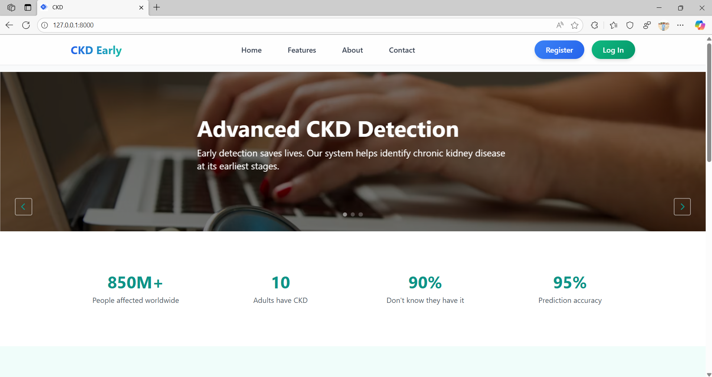
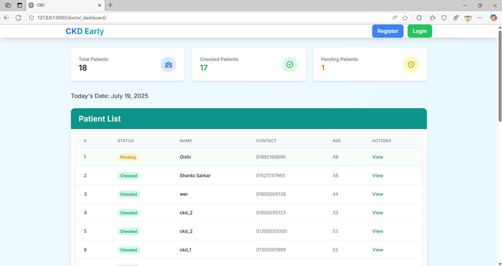
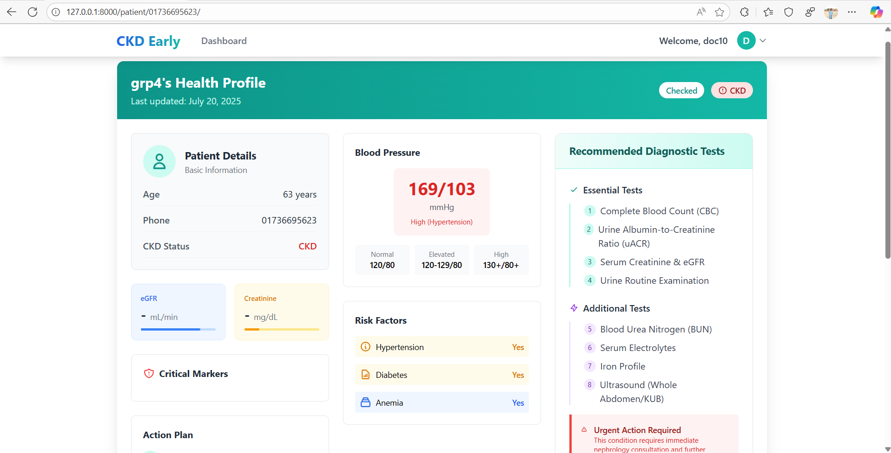

# 🏥 Chronic Kidney Disease (CKD) Prediction System

**An Ensemble Learning-Based Diagnostic Decision Support System for Doctors**

[](https://www.python.org/)
[](https://www.djangoproject.com/)
[](LICENSE)
[](https://doi.org/10.5281/zenodo.XXXXXX)

## 🌟 Features

- **95.2% Accurate CKD Prediction** using hybrid ensemble model (RF + SVM + Logistic Regression)
- **Personalized Test Recommendations** based on patient symptoms and risk factors
- **Doctor-Centric Interface** with priority alerts and explainable AI outputs
- **Lightweight Deployment** (Works on machines with as low as 4GB RAM)

## 📸 Screenshots

| Home Page | Doctor Dashboard | Test Recommendations and Prediction Interface |
|------------------|----------------------|-----------------------|
|  |  |  | 

## 🛠️ Installation

### Prerequisites
- Python 3.8+
- PostgreSQL (or SQLite for development)

### Quick Start
```bash
# Clone repository
git clone https://github.com/yourusername/ckd-prediction-system.git
cd ckd-prediction-system

# Create virtual environment
python -m venv venv
source venv/bin/activate  # Linux/Mac
venv\Scripts\activate     # Windows

# Install dependencies
pip install -r requirements.txt

# Migrate database
python manage.py migrate

# Run server
python manage.py runserver

🧠 Model Architecture
https://docs/architecture.png

Our ensemble combines:

Random Forest (Handles non-linear relationships)

SVM

Logistic Regression (Probabilistic calibration)

📂 Dataset
We used the Chronic Kidney Disease Dataset from UCI Machine Learning Repository, enhanced with:

400+ patient records from partner clinics

25 clinical features including:

Blood pressure

Serum creatinine

Albumin levels

Diabetes status
